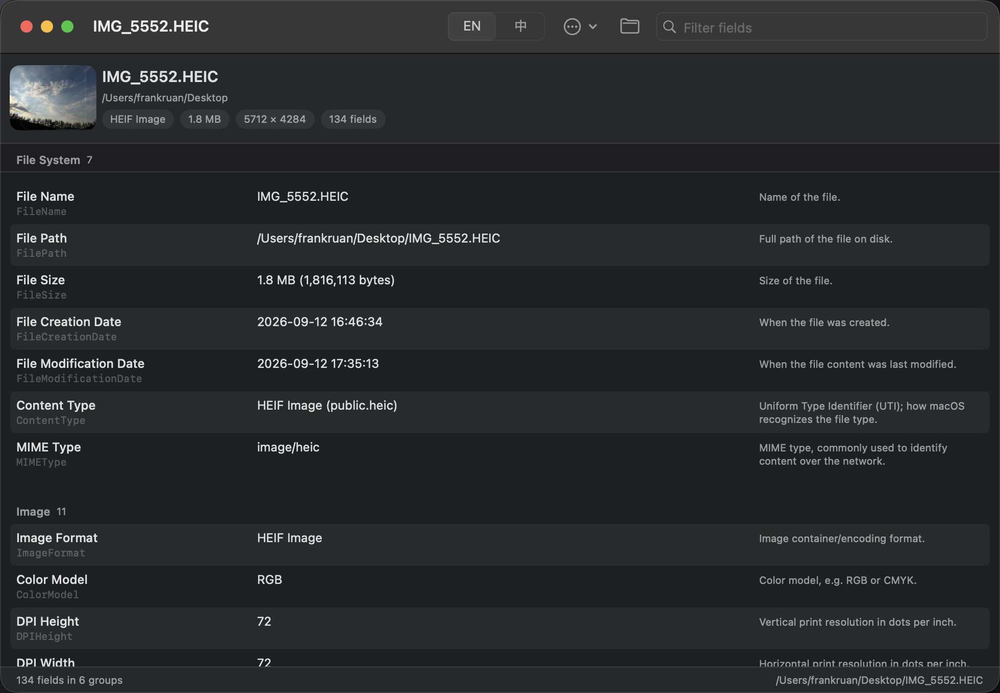
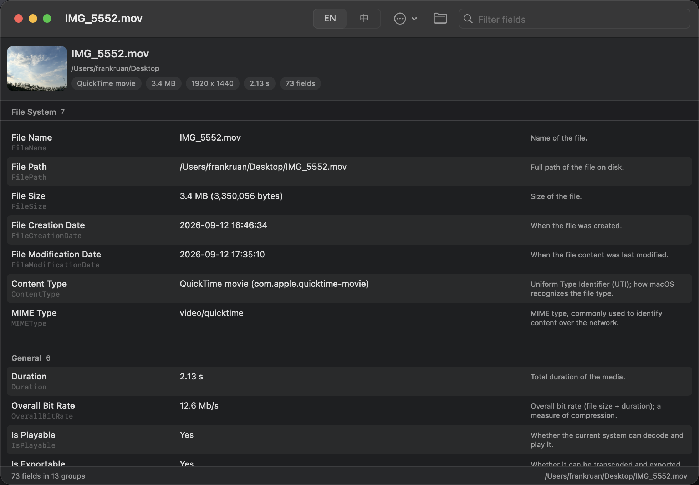

# ExifChecker

A native macOS desktop tool — written in Swift 6 / SwiftUI — that graphically
inspects **EXIF data and metadata of arbitrary media files** (images, videos,
audio), inspired by the CLI tools [`exiftool`](https://exiftool.org) and
[`ffprobe`](https://ffmpeg.org/ffprobe.html).

No external dependencies: everything is read through Apple's own frameworks,
so the app needs neither exiftool nor ffmpeg installed.

| Image (HEIC) with Chinese annotations | Video (MOV) with English annotations |
| --- | --- |
|  |  |

## Features

- **Images** (JPEG, HEIC/HEIF, PNG, GIF, TIFF, DNG, WebP, …) via ImageIO:
  file system info, pixel format, color profile, full EXIF / TIFF / GPS /
  IPTC / Maker Notes dictionaries.
- **Videos & audio** (MOV, MP4, M4V, MP3, M4A, WAV, FLAC, …) via
  AVFoundation: duration, overall bit rate, per-track codec details
  (FourCC + long name, dimensions, frame rate, sample rate, channels,
  bit depth, rotation, color primaries/transfer), and embedded QuickTime /
  iTunes / ID3 metadata.
- **Human-friendly values**, exiftool style: `1/920 s`, `ƒ/1.8`,
  `24 mm`, `ISO 80`, `14.5 Mb/s`, GPS coordinates as
  `48° 51' 30.24" N`, decoded EXIF enum/bitmask fields
  (orientation, flash, metering mode, …).
- **Bilingual field annotations** — common fields carry a short explanation
  in English *and* Chinese; switch instantly with the `EN / 中` toggle in
  the toolbar. Unknown or vendor-specific fields are displayed raw,
  without annotation ("leave it as-is").
- **Search / filter** across keys, values and annotations.
- **Export**: copy the whole report to the clipboard or save it as JSON
  (ordered schema that preserves all displayed entries — see below).
- **CLI dump mode** for scripting and automation (see below).
- Drag & drop, open panel, Finder "Open With" support (when bundled),
  thumbnails (image preview, video poster frame, embedded audio artwork).

## Requirements

- macOS 14 (Sonoma) or later
- Xcode 16 / Swift 6 toolchain (to build from source)

## Build & run

```sh
make            # release build + package dist/ExifChecker.app
make open       # same, then launch the app
make run        # quick debug build, run straight from the terminal
make test       # run the unit test suite
make install    # copy the app into /Applications
make clean      # remove .build/ and dist/
```

The `Makefile` is the single source of truth; `swift build` /
`swift test` work directly too.

## CLI dump mode

The same binary doubles as a command line tool, mirroring the spirit of
`exiftool -G1 -s`:

```sh
dist/ExifChecker.app/Contents/MacOS/ExifChecker --dump ~/Desktop/sample.heic
# multiple files at once (reports separated by a blank line):
.build/release/ExifChecker --dump photo.heic clip.mov
# or via make (requires your own samples at the paths set in the Makefile):
make dump-heic
make dump-mov
```

- `--dump`/`-d` accepts one or more files; every report starts with a
  `File: <path>` header line.
- `--help` prints usage. Exit codes: `0` success, `1` when a file could not
  be read, `64` (EX_USAGE) for bad invocations.

Sample output (trimmed, from a video file):

```
[File System]          FileSize             : 3.4 MB (3,350,056 bytes)
[General]              Duration        : 2.13 s
[General]              OverallBitRate  : 12.6 Mb/s
[Video Track 1]        Codec             : HEVC (H.265) (hvc1)
[Video Track 1]        Dimensions        : 1920 x 1440
[Video Track 1]        NominalFrameRate  : 29.53 fps
[Audio Track 7]        Codec             : Linear PCM (lpcm)
[QuickTime Metadata]   Model                            : iPhone 17 Pro
```

## JSON export schema

`Export JSON…` preserves the order and values of all displayed entries. Groups and items
are arrays (not name/key-keyed dictionaries), so duplicate group names and
repeated keys within a group — both legitimate in real containers — survive
the round trip:

```json
{
  "file": "/path/to/photo.heic",
  "fileSize": 3210528,
  "kind": "image",
  "groups": [
    { "name": "EXIF",
      "items": [ { "key": "FNumber", "value": "ƒ/1.78" } ] }
  ]
}
```

## Project layout

```
├── Makefile                  # build / run / test / bundle / install
├── Package.swift             # SPM manifest (core lib + app + tests)
├── Resources/Info.plist      # bundle metadata for dist/ExifChecker.app
├── Sources/
│   ├── ExifCheckerCore/      # pure library, no UI — unit testable
│   │   ├── Models/           # MetadataDocument / Group / Item, GroupBuilder
│   │   ├── Formatting/       # ValueFormatter (EXIF enums, APEX, GPS DMS, …)
│   │   ├── Descriptions/     # FieldDescriptions — bilingual EN/中文 notes
│   │   └── Extractors/       # File / ImageIO / AVFoundation / dispatcher
│   └── ExifChecker/          # the app target
│       ├── App/              # SwiftUI App + menu commands
│       ├── Views/            # drop zone, header, browser rows, root view
│       ├── ViewModels/       # AppViewModel (load / search / export / copy)
│       ├── Support/          # CLI dumper, thumbnail loader
│       └── main.swift        # branches between GUI and --dump CLI mode
└── Tests/ExifCheckerCoreTests/
```

## How it works

1. `MetadataLoader` inspects the file's Uniform Type Identifier and routes
   it: images go to `ImageMetadataExtractor` (ImageIO), audiovisual files to
   `AVMetadataExtractor` (AVFoundation). Unknown types try both; file system
   information is always included. Missing paths, directories, and
   unreadable files are rejected up front with
   `ExtractionError.unreadableFile`.
2. Raw container dictionaries are flattened into `MetadataGroup`s; every
   value passes through `ValueFormatter`, which knows how to render
   well-known fields (APEX shutter/aperture, flash bitmasks, GPS DMS, …) and
   leaves everything else untouched.
3. `FieldDescriptions` attaches a bilingual annotation to common fields.
   Both language variants are stored in the model, so the UI toggle is
   instant and no re-scan is needed.

## Testing

`swift test` runs 40 tests covering:

- value formatting (shutter fractions, APEX math, enum tables, GPS DMS),
- the annotation database (bilingual, case-insensitive, nil for unknown),
- report/export fidelity: plain-text column clamping for long names, and a
  JSON schema that preserves duplicate group names and keys,
- `GroupBuilder` ordering (natural sort) and nil-value skipping,
- end-to-end extraction on in-memory fixtures (a synthetic JPEG with
  EXIF/TIFF/GPS and a generated PCM WAV file),
- error handling for missing files, directories, and permission-less files
  (all rejected as `unreadableFile` before extraction starts).

## License

Licensed under the [Apache License, Version 2.0](LICENSE).
